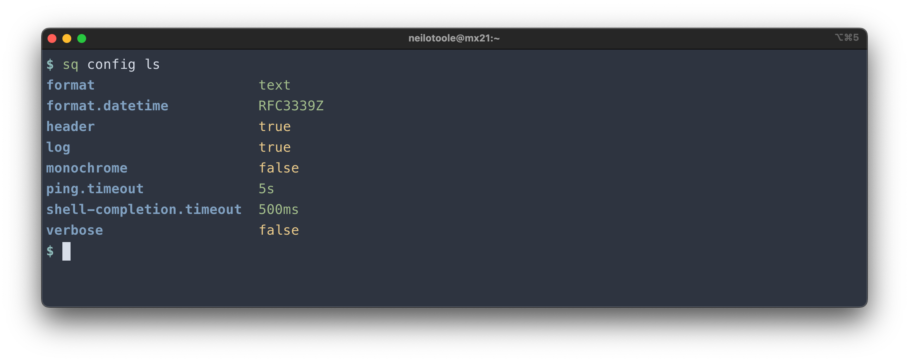
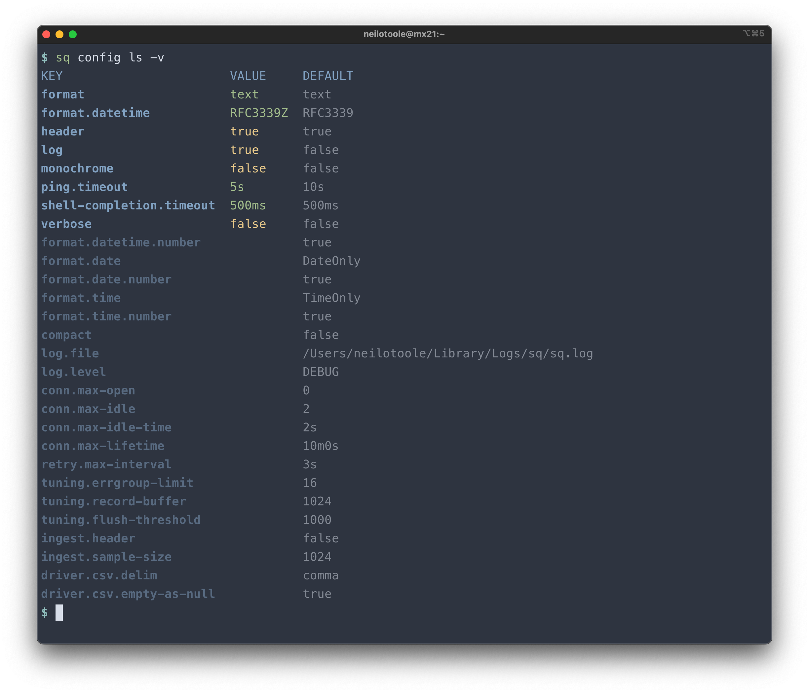
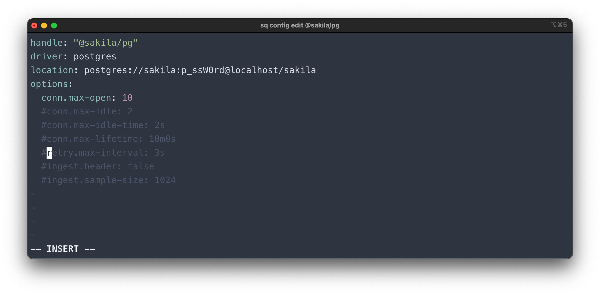

`sq` aims to work out of the box with sane defaults, but allows you to configure most
everything. `sq`'s total configuration state consists of a collection of
data [sources](/docs/source) and [groups](/docs/source/#groups), and a plethora
of configuration options. That's what this section is about. There are two levels
of options:

- Base config, consisting of many options. Each option is a key-value pair, e.g. `format=json`, or `conn.max-open=50`
- Source-specific config. Each source can have its own value for, say, `conn.max-open`. If an option is not explicitly set on a source, the source inherits that
  option value from base config.

## Commands

`sq` provides commands to [locate](#location), [list](#ls), [`get`](#get),
[`set`](#set), and [`edit`](#edit) config. The config commands provide extensive
shell-completion, so feel free to hit `TAB` while
entering a command, and `sq` will guide you.


### `location`

`sq` stores its main config in a `sq.yml` file in its config dir. You don't usually
need to edit the config directly: `sq` provides several mechanisms for managing config.

The location of `sq's` config dir is OS-dependent. On macOS, it's here:

```shell
$ sq config location
/Users/neilotoole/.config/sq
```

You can specify an alternate location by setting envar `SQ_CONFIG`:

```shell
$ export SQ_CONFIG=/tmp/sq
$ sq config location
/tmp/sq
```

You can also specify the config dir via the `--config` flag:

```shell
$ sq --config=/tmp/sq2 config location
/tmp/sq2
```

### `ls`

Use `sq config ls` to list the options that have been set.

```shell
# List config options
$ sq config ls
```



Well, there's more. A lot more. Use `sq config ls -v` to also see unset options,
along with their default values.



Note in the image above that some options don't have a value. That is to say,
the option is _unset_. When _unset_, an option takes on its default value.


If you want a wall of text, try `sq config ls -yv` (the `-y` flag is for
`--yaml` output). That's the maximum amount of detail available.


As well as listing base config, you can view config options for a source.

```shell
$ sq config ls --src @actor_csv -v
```


### `get`

`sq config get` is like the single-friend counterpart of `sq ls`. It gets the
value of a single option.

```shell
# Get base value of "format" option
$ sq config get format
text

# Get the "conn.max-open" option value for a particular source
$ sq config get --src @actor_csv conn.max-open
10
```

### `set`

Use `sq config set` or `sq config set --src` to set an option value.

```shell
# Set base option value
$ sq config set format json

# Set source-specific option value
$ sq config set --src @sakila_pg conn.max-open 20
```

To get help for a specific option, execute `sq config set OPTION --help`.


### `edit`

In the spirit of [`kubectl edit`](https://kubernetes.io/docs/reference/generated/kubectl/kubectl-commands#edit),
you can edit base config or source-specific config via the
default editor, as defined in envar `$EDITOR` or `$SQ_EDITOR`.

```shell
# Edit base config
$ sq config edit

# Edit config for source
$ sq config edit @sakila

# Use a different editor
$ SQ_EDITOR=nano sq config edit
```



If you add the `-v` flag (`sq config edit -v`), the editor will show
additional help for the options.


## Logging

By default, logging is turned off. If you need to submit a `sq`
[bug report](https://github.com/neilotoole/sq/issues), you'll likely
want to include the `sq` log file.

```shell
# Enable logging
$ sq config set log true

# Default log level is DEBUG... you can change it if you want.
# But leave it on DEBUG if you're sending bug reports.
$ sq config set log.level WARN

# You can also change the log file location. The default location
# is OS-dependent.
$ sq config get log.file -v
KEY       VALUE  DEFAULT
log.file         /Users/neilotoole/Library/Logs/sq/sq.log
```



If there's a problem with `sq`'s bootstrap
mechanism (e.g. corrupt config file),
and logs aren't being generated, it's preferable
to use envars to force logging.

```shell
export SQ_LOG=true; export SQ_LOG_LEVEL=DEBUG; export SQ_LOG_FILE=./sq.log
```



## Options

Below, all available options are listed. Use `sq config set OPTION` to
modify the option value.

Some config options apply only to base config. For example, `format=json` applies
to the `sq` CLI itself, and not to a particular source such as `@sakila`. However,
some options can apply to a source, and also have a base value. For example,
`conn.max-open` controls the maximum number of connections that `sq` will open
to a database.


## CLI

### `log`


### `log.file`


### `log.level`


### `ping.timeout`



### `shell-completion.timeout`


<a id="formatting"></a>
## Output

### `compact`


### `format`


### `format.datetime`


### `error.format`


### `format.datetime.number`


### `format.date`


### `format.date.number`


### `format.time`


### `format.time.number`


### `format.excel.datetime`


See also: [Excel date/time format reference](https://support.microsoft.com/en-gb/office/format-numbers-as-dates-or-times-418bd3fe-0577-47c8-8caa-b4d30c528309#bm2)

### `format.excel.date`


See also: [Excel date/time format reference](https://support.microsoft.com/en-gb/office/format-numbers-as-dates-or-times-418bd3fe-0577-47c8-8caa-b4d30c528309#bm2)

### `format.excel.time`


See also: [Excel date/time format reference](https://support.microsoft.com/en-gb/office/format-numbers-as-dates-or-times-418bd3fe-0577-47c8-8caa-b4d30c528309#bm2)


### `header`


### `monochrome`


### `verbose`


### `result.column.rename`



The `result.column.rename` option is rather arcane: it allows you to change
the way `sq` de-duplicates column names. By default, a result set containing
duplicate column names is renamed like this:

```SQL
-- Columns returned from DB...
actor_id, first_name, last_name, last_update, actor_id, film_id, last_update

-- are renamed to
actor_id, first_name, last_name, last_update, actor_id_1, film_id, last_update_1
```

Thus, the second `actor_id` column becomes `actor_id_1`. Let's say you instead
wanted the column to be renamed to `actor_id:1`. Change the template value to
use `:` instead of `_`.


```shell
$ sq config set result.column.rename '{{.Name}}{{with .Recurrence}}:{{.}}{{end}}'
```

The option value must be a valid [Go text template](https://pkg.go.dev/text/template).
In addition to the standard Go functions, the [sprig](https://masterminds.github.io/sprig/)
functions are available. Here's an example of a template using the sprig `upper` function to
rename each column to uppercase.

```text
{{.Name | upper}}{{with .Recurrence}}:{{.}}{{end}}
```

The `.AlphaIndex` template fields maps the column index to `A, B ... Y, Z, AA, AB...`,
similar to how Microsoft Excel names columns. To use this style:

```shell
$ sq config set result.column.rename '{{.AlphaIndex}}'
$ sq .actor
```


Note that [`ingest.column.rename`](#ingestcolumnrename) and
[`result.column.rename`](#resultcolumnrename) are distinct options.
The _ingest_ option is applied to ingest data (e.g. a CSV file) column names before the data is sent to
the database (pre-processing). The _result_ option, by contrast, is applied
to result set column names after the data is returned from the database (post-processing).
It is possible (and normal) to use both options.


### `diff.data.format`


### `diff.lines`


## Tuning

### `conn.max-idle`


### `conn.max-idle-time`


### `conn.max-lifetime`


### `conn.max-open`


### `conn.open-timeout`


### `retry.max-interval`


### `tuning.errgroup-limit`


### `tuning.flush-threshold`


### `tuning.record-buffer`


## Ingest

### `ingest.column.rename`



Note that [`ingest.column.rename`](#ingestcolumnrename) and
[`result.column.rename`](#resultcolumnrename) are distinct options.
The _ingest_ option is applied to ingest data (e.g. a CSV file) column names before the data is sent to
the database (pre-processing). The _result_ option, by contrast, is applied
to result set column names after the data is returned from the database (post-processing).
It is possible (and normal) to use both options.



### `ingest.header`


### `ingest.sample-size`


### `driver.csv.delim`


### `driver.csv.empty-as-null`



