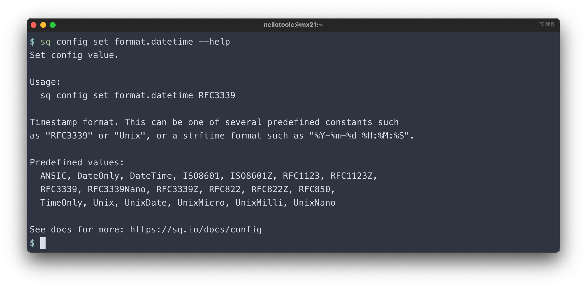
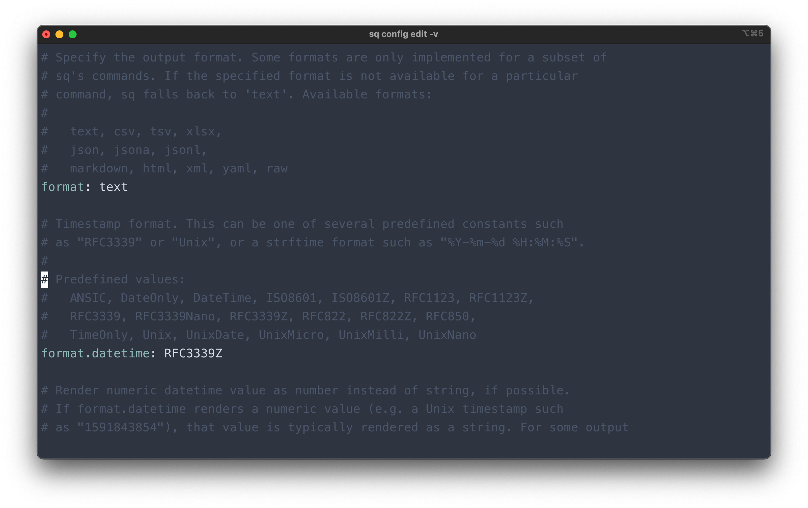

`sq` aims to work out of the box with sane defaults, but allows you to configure most
everything. Let's start off with the basics.

`sq`'s total configuration state is:

- A collection of data [sources](/docs/source) and [groups](/docs/source/#groups).
- And a bunch of configuration options.

The config options consist of:
- Base config, consisting of many options.
  - Each option is a key-value pair, e.g. `format=json`, or `conn.max-open=50`
- Source-specific config.
  - If an option is not explicitly set on a source, the source inherits that
    option value from base config.

Let's take a look at the functionality.

## Commands

`sq` provides commands to `ls`, `get`, `set`, and `edit` config. Note that
the commands provide extensive shell-completion, so feel free to hit `TAB` while
entering the command, and `sq` will guide you.


### `location`

`sq` stores its main config in a `sq.yml` file in its config dir. You don't usually
need to edit the config directly: `sq` provides several mechanisms for managing config.

The location of `sq's` config dir is OS-dependent. On macOS, it's here:

```shell
$ sq config location
/Users/neilotoole/.config/sq
```

You can specify an alternate location by setting envar `SQ_CONFIG`:

```shell
$ export SQ_CONFIG=/tmp/sq
$ sq config location
/tmp/sq
```

You can also specify the config dir via the `--config` flag:

```shell
$ sq --config=/tmp/sq2 config location
/tmp/sq2
```

### `ls`

Use `sq config ls` to list the options that have been set.

```shell
# List config options
$ sq config ls
```


Well, there's more. A lot more. Use `sq config ls -v` to also see unset options,
along with their default values.


Note in the image above that some options don't have a value. That is to say,
the option is _unset_. When _unset_, an option takes on its default value.


If you want a wall of text, try `sq config ls -yv` (the `-y` flag is for
`--yaml` output). That's the maximum amount of detail available.


As well as listing base config, you can view config options for a source.

```shell
$ sq config ls --src @actor_csv -v
```


### `get`

`sq get` is like the single-friend counterpart of `sq ls`. It gets the
value of a single option.

```shell
# Get base value of "format" option
$ sq config get format
format  text

$ sq config get --src @actor_csv conn.max-open
conn.max-open  10

```

### `set`

Use `sq config set` or `sq config set --src` to set an option value.

```shell
# Set base option value
$ sq config set format json

# Set source-specific option value
$ sq config set --src @sakila_pg conn.max-open 20
```

To get help for a specific option, execute `sq config set OPTION --help`.



### `edit`

In the spirit of [`kubectl edit`](https://kubernetes.io/docs/reference/generated/kubectl/kubectl-commands#edit),
you can edit base config or source-specific config via the
default editor, as defined in envar `$EDITOR` or `$SQ_EDITOR`.

```shell
# Edit base config
$ sq config edit

# Edit config for source
$ sq config edit @sakila

# Use a different editor
$ SQ_EDITOR=nano sq config edit
```


If you add the `-v` flag (`sq config edit -v`), the editor will show
additional help for the options.




## Options

Some config options apply only to base config. For example, `format=json` applies
to the `sq` CLI itself, and not to a particular source such as `@sakila`. However,
some options can apply to a source, and also have a base value. For example,
`conn.max-open` controls the maximum number of connections that `sq` will open
to a database. You can


## Logging

By default, logging is turned off. If you need to submit a `sq`
[bug report](https://github.com/neilotoole/sq/issues), you'll likely
want to include the `sq` log file.

```shell
# Enable logging
$ sq config set log true

# Default log level is DEBUG... you can change it if you want.
# But leave it on DEBUG if you're sending bug reports.
$ sq config set log.level WARN

# You can also change the log file location. The default location
# is OS-dependent.
$ sq config get log.file -v
KEY       VALUE  DEFAULT
log.file         /Users/neilotoole/Library/Logs/sq/sq.log
```
