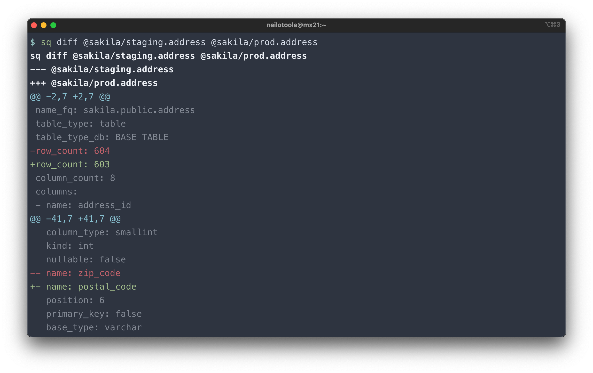
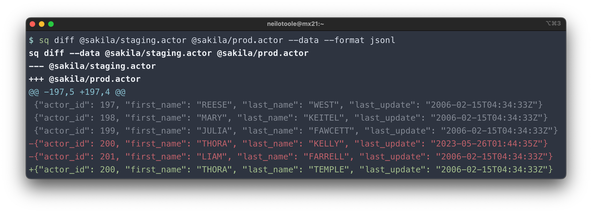
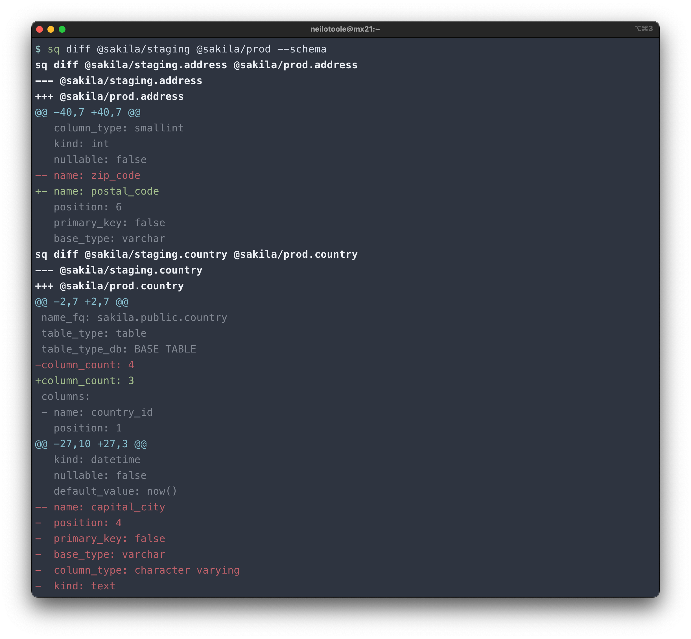
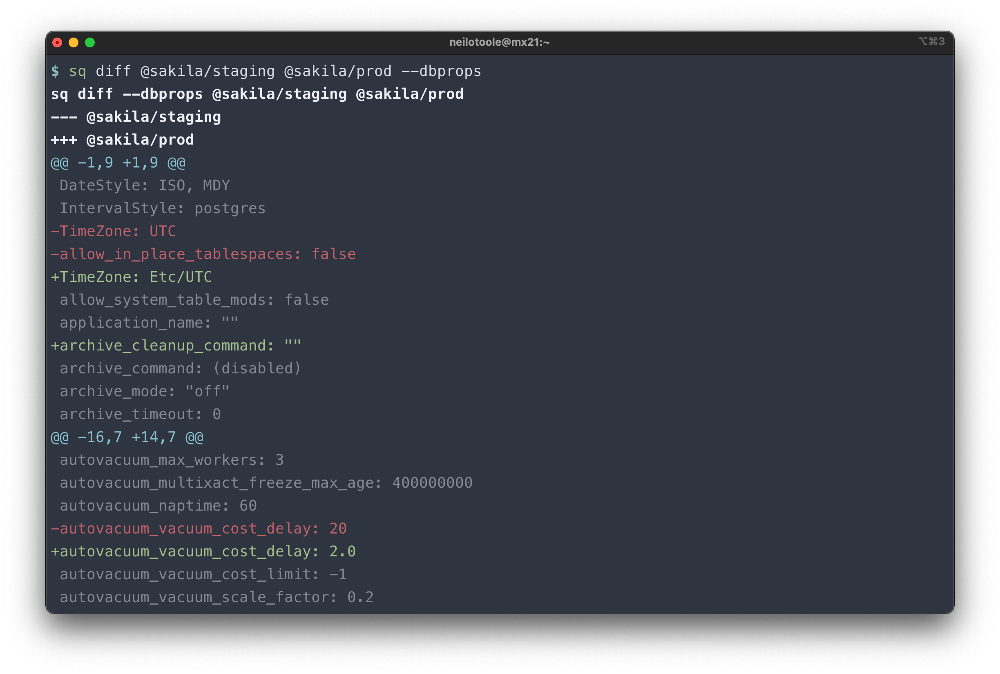

[`sq diff`](/docs/cmd/diff) compares metadata, or row data, for sources, or individual tables.


`sq diff` takes as arguments either a pair of sources ("source diff"), or
a pair of tables ("table diff"). For our examples, we'll use a pair of
Postgres databases, `@sakila/prod` and `@sakila/staging`.


`sq diff` is in beta release. There is still work to be done with performance,
scalability, and testing. It is likely that the implementation will change
based upon user feedback. If you find a bug, please open an
[issue](https://github.com/neilotoole/sq/issues/new/choose).
General feedback can be left on the [diff discussion](https://github.com/neilotoole/sq/discussions/238).



Use flags to specify the elements you want to compare. The available elements are:

- `--overview`: source metadata, without schema (source diff only)
- `--dbprops`:  database/server properties (source diff only)
- `--schema`: schema structure, for database or individual table
- `--counts`: show row counts when using `--schema`
- `--data`: row data values
- `--all`: all of the above


Note that you can combine flags:

```shell
# Longhand
$ sq diff @sakila/staging @sakila/prod --overview --dbprops --schema

# Shorthand
$ sq diff @sakila/staging @sakila/prod -OBS
```



## Default behavior

For table diff, the default behavior is to diff table schema and row counts.
Table row data is not compared.

```shell
# Diff the "address" table in staging vs prod.
$ sq diff @sakila/staging.address @sakila/prod.address
```



In the example above, we see that the row counts differ, and also that
the table structure is different: the column `zip_code` in `@sakila/staging`
is named `postal_code` in `@sakila/prod`.

For source diff, the default behavior is to diff the
source overview, schema, and table row counts. Table row data is not compared.

```shell
$ sq diff @sakila/staging @sakila/prod
```


## `--data`

To compare row data, use the `--data` (`-d`) flag.

```shell
# Diff the rows of the "actor" table in staging vs prod.
$ sq diff @sakila/staging.actor @sakila/prod.actor --data
```


### `--stop`

In early releases, `sq diff --data` would compare every row in the table. Most
often this wasn't desired. After the first 500 differing rows or so, you probably
got the idea; the next 999,500 rows of terminal output weren't really helping.

Now diff will stop after N differences, where N is controlled by the `--stop`
(`-n`) flag, or the [`diff.stop`](/docs/config/#diffstop) config setting. The
default is `3`.

```shell
# Show the first 5 differing rows.
$ sq diff @sakila/staging.actor @sakila/prod.actor --data --stop 5

# Show only the first differing row, using the -n shorthand.
$ sq diff @sakila/staging.actor @sakila/prod.actor --data -n1

# You can still diff all rows using --stop 0.
$ sq diff @sakila/staging.actor @sakila/prod.actor --data --stop 0
```


### `--format`

Use the `--format` (`-f`) flag with `--data` to specify the row data output format.



The default is `text`. The available  formats are:  `text`, `csv`, `tsv`,`json`,
`jsona`, `jsonl`, `markdown`, `html`, `xml`, `yaml`.

You can change the
default via [`sq config set diff.data.format`](/docs/config/#diffdataformat).


The `--format` flag only works in conjunction with row data diff (`--data`). Metadata
diff (e.g. `--schema`) is currently always output in YAML.



## `--schema`

Use `--schema` (`-S`) to compare only schema/structure. This applies both
to source diff and table diff.


```shell
# Compare the structure of every table/view in staging vs prod.
$ sq diff @sakila/staging @sakila/prod --schema
```



### `--counts`

Use `--counts` (`-N`) in conjunction with `--schema` to also see row counts.

```shell
# Show schema for each table, and row counts.
$ sq diff @sakila/staging @sakila/prod --schema --counts

# Shorthand
$ sq diff @sakila/staging @sakila/prod -SC

```

## `--overview`

Use `--overview` (`-O`) to diff high-level source metadata. This flag applies
only to source diff. It compares
the source definitions (handle, driver, location), as well as some high-level
information about the database (product, version, etc.).

```shell
$ sq diff @sakila/staging @sakila/prod --overview
```


## `--dbprops`

Use `--dbprops` (`-B`) to diff database/server properties. Applies only to source diff.

```shell
$ sq diff @sakila/staging @sakila/prod --dbprops
```



## `--all`

Use `--all` (`-a`) to diff every element in both sources. Use with caution with
large tables.

```shell
$ sq diff @sakila/staging @sakila/prod --all
```


## `--unified` (lines)

You can control the number of surrounding lines using the `--unified` (`-U`) flag.
The default is `3`.

```shell
# Don't show any surrounding lines
$ sq diff @sakila/staging.actor @sakila/prod.actor --data -U0

# Show 5 surrounding lines
$ sq diff @sakila/staging.actor @sakila/prod.actor --data -U5
```


You can set the default number of lines
via [`sq config set diff.lines`](/docs/config/#difflines).



The `--unified` flag could easily have been named `--lines` or such, but we
stick with `--unified` for alignment with the familiar `diff` and `git diff` commands.


